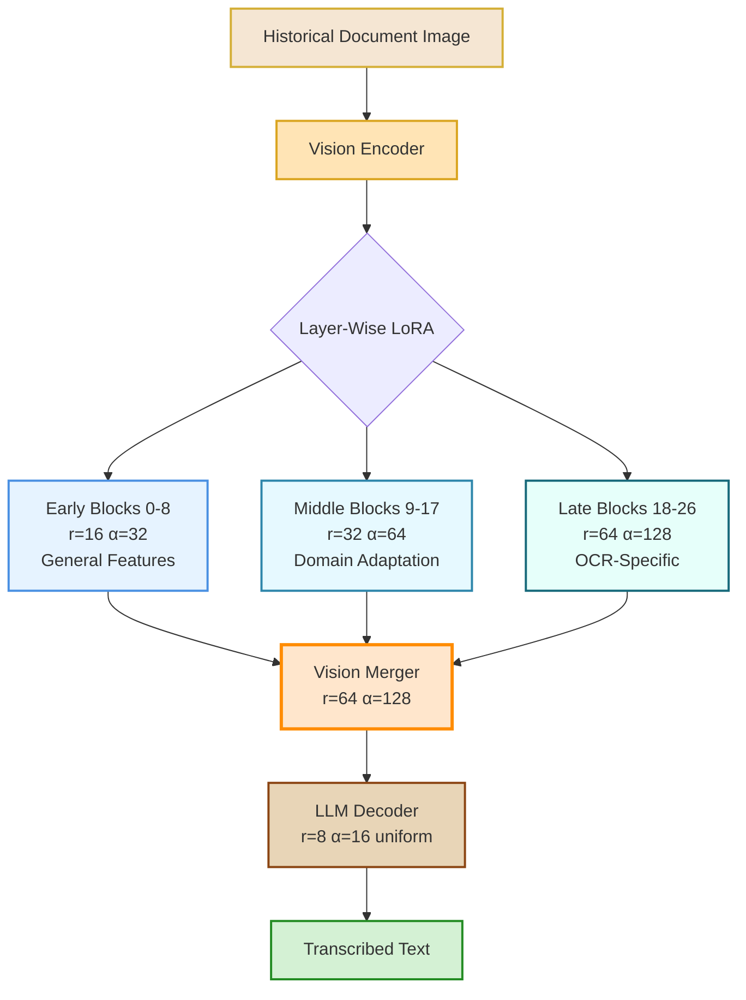
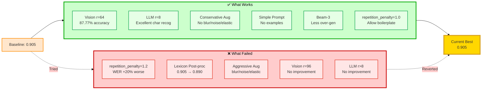
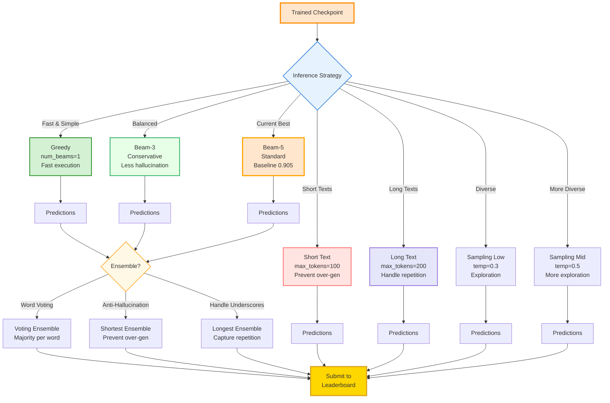
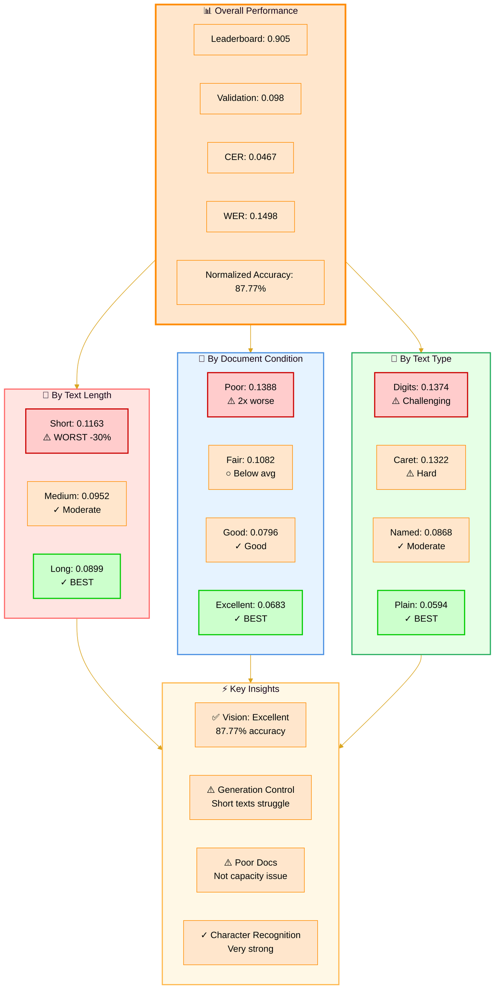
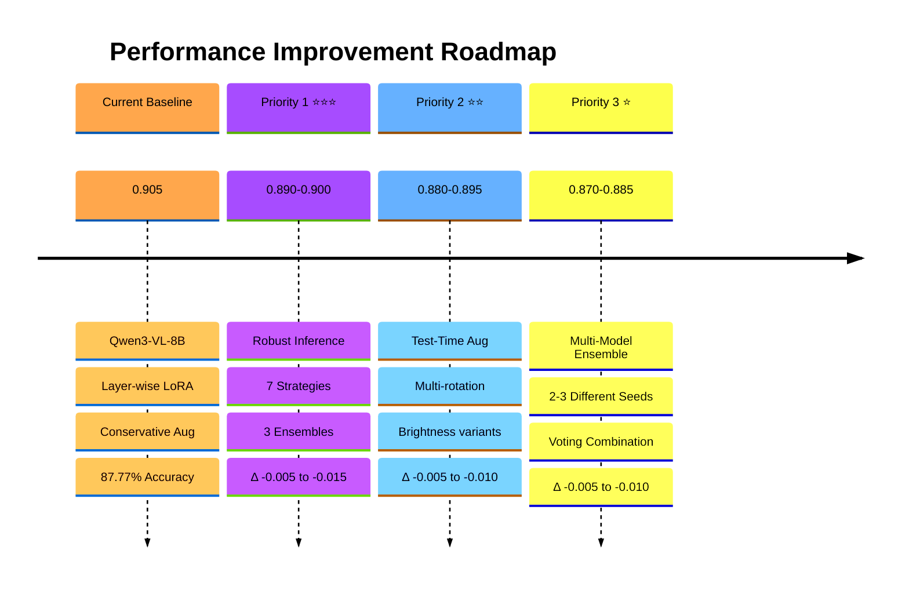
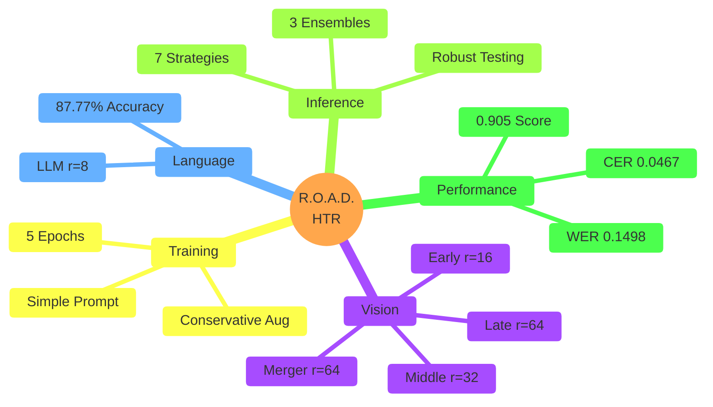

<div align="center">


# R.O.A.D. Historical HTR Pipeline

**Reclaiming Our Atlantic Destiny**

A fine-tuning and evaluation pipeline for historical document Handwritten Text Recognition (HTR) using Vision-Language Models (Qwen3-VL-8B Instruct). Optimized for challenging, degraded archival records from 17th-18th century Barbados featuring complex handwriting, caret insertions, historical spelling, and structured repetition (underscores, boilerplate text).

[](https://zindi.africa)
[](https://zindi.africa)
[](https://zindi.africa)
[](https://zindi.africa)

---

## 📑 Table of Contents

- [Features & Key Innovations](#-features--key-innovations)
- [Repository Structure](#-repository-structure)
- [Requirements & Setup](#%EF%B8%8F-requirements--environment-setup)
- [Quick Start](#-quick-start)
  - [Pipeline Overview](#pipeline-overview)
  - [Training](#3-training)
  - [Inference](#4-standard-inference)
  - [Robust Inference](#5-robust-inference-recommended-for-improvement)
- [Evaluation & Metrics](#-evaluation--metrics)
- [Performance Optimization](#-performance-optimization-strategy)
- [Documentation](#-documentation)
- [Competition Context](#-competition-context)

</div>

---

## 📌 Features & Key Innovations

### Architecture & Training

* **Model**: `Qwen3-VL-8B-Instruct` with `bfloat16` precision and optional FlashAttention-2
* **Layer-Wise LoRA Strategy** (Vision-Adapted):
  * **Vision Early Blocks (0-8)**: r=16 (preserve general visual features)
  * **Vision Middle Blocks (9-17)**: r=32 (domain adaptation begins)
  * **Vision Late Blocks (18-26)**: r=64 (OCR-specific representations)
  * **Vision Merger**: r=64 (critical vision→text bridge)
  * **LLM**: r=8 uniform (sufficient - 87.77% normalized word accuracy)
  * Implemented via Rank-Stabilized LoRA (`use_rslora: true`) for mixed-rank stability


* **Conservative Augmentation** (Critical for Pre-Degraded Documents):
  * ✅ **Enabled**: Brightness (0.3), contrast (0.3), rotation (0.3), shear (0.2)
  * ❌ **Disabled**: Blur, noise, elastic deformation (documents already degraded!)
  * Prevents adding degradation to already-faded, warped historical pages
* **Simple OCR Prompt** (Hallucination-Resistant):
  ```
  Transcribe the visible text exactly as written.
  Preserve all spelling, capitalization, punctuation, and special characters.
  Transcribe only what you see in the image—nothing more.
  ```
  * No examples or historical context that could prime pattern completion
* **Generation Control**:
  * `num_beams: 3` (reduced from 5 - less over-generation)
  * `repetition_penalty: 1.0` (NO penalty - historical docs have legitimate repetition!)
  * `no_repeat_ngram_size: 0` (allow "___ ___ ___" sequences and boilerplate)

### Evidence-Based Findings

**Validation Analysis (410 samples):**
- **87.77% normalized word accuracy** (≤1 character difference) - **Excellent character recognition**
- SHORT texts perform worst (0.1163) - 30% worse than long texts (0.0899)
- Main issue: Generation control, NOT vision capacity
- Poor-condition gap: 2x worse (0.1388 vs 0.0683)

**What Works:**
- ✅ Conservative augmentation (no blur/noise on degraded docs)
- ✅ Simple prompt without examples
- ✅ Vision r=64 (sufficient - proven by 87.77% accuracy)
- ✅ LLM r=8 (sufficient - excellent character recognition)
- ✅ Layer-wise LoRA (gradual rank increase through vision encoder)
- ✅ Reduced beam search (3 beams instead of 5)

**What Doesn't Work (Documented Failures):**
- ❌ **Repetition penalty > 1.0**: Made WER 20% worse (0.1618 → 0.1935)
  - Historical documents have legitimate repetition ("the said", "heires and assignes")
- ❌ **Lexicon post-processing**: Dropped score from 0.905 → 0.890
  - Training lexicon ≠ test distribution
- ❌ **Aggressive augmentation**: Adding blur/noise/elastic to already-degraded docs
- ❌ **Increasing ranks beyond current**: Not needed (vision already excellent)

See `LESSONS_LEARNED.md` for detailed analysis of failed experiments.



---

## 📁 Repository Structure

```
ROAD/
├── dataset/
│   ├── images/                    # 5472 JPG images (flattened directory)
│   ├── Train.csv                  # 4098 training samples (ID, Target)
│   ├── Test.csv                   # 1373 test samples (ID only)
│   └── SampleSubmission.csv
├── src/
│   └── qwen2vl/
│       ├── configs/
│       │   └── config_qwen3_8b_vision_adapted.yaml  # Current best config
│       ├── train.py               # Main training script
│       ├── inference.py           # Standard inference (single strategy)
│       ├── robust_inference.py    # Multi-strategy inference testing
│       ├── LESSONS_LEARNED.md     # Documented failed approaches
│       └── IMPROVEMENT_GUIDE.md   # Evidence-based improvement strategy
├── CLAUDE.md                      # Project guide for AI assistants
└── README.md
```

---

## 🛠️ Requirements & Environment Setup

**System Requirements:**
- Python 3.11+
- PyTorch 2.6+ with CUDA support
- **GPU**: A100 80GB recommended (training ~6-8 hours)
  - Alternatives: A100 40GB, L4, T4 (slower, may need batch size reduction)
- 16GB+ RAM (32GB recommended)

### Installation

```bash
# Clone the repository
git clone https://github.com/ageraustine/ROAD.git
cd ROAD

# Install dependencies
cd src/qwen2vl
pip install -r requirements.txt
```

**Key Dependencies:**
```text
torch >= 2.6.0
transformers >= 4.45.0, < 5.0.0
peft >= 0.13.0, < 0.15.0
opencv-python-headless
scipy
Pillow
editdistance
flash-attn (optional, auto-fallback)
```

---

## ⚡ Quick Start

### Pipeline Overview

```mermaid
flowchart LR
    subgraph Data["📦 Data Preparation"]
        A1[4098 Train Images] --> A2[Stratified Split]
        A2 --> A3[90% Train<br/>10% Val]
        A4[1373 Test Images]
    end

    subgraph Aug["🎨 Augmentation"]
        B1[Conservative Strategy]
        B2[✅ Brightness 0.3]
        B3[✅ Contrast 0.3]
        B4[✅ Rotation 0.3]
        B5[❌ NO Blur/Noise]
    end

    subgraph Train["🎓 Training"]
        C1[Qwen3-VL-8B]
        C2[Layer-wise LoRA<br/>r=8-64]
        C3[5 Epochs<br/>LR=5e-5]
        C4[Early Stop<br/>patience=3]
    end

    subgraph Eval["📊 Validation"]
        D1[CER: 0.0467]
        D2[WER: 0.1498]
        D3[Score: 0.098]
    end

    subgraph Infer["🔮 Inference"]
        E1{Strategy?}
        E1 --> E2[Greedy]
        E1 --> E3[Beam-3]
        E1 --> E4[Beam-5]
        E1 --> E5[Short Text]
        E1 --> E6[Long Text]
        E1 --> E7[Ensemble]
    end

    subgraph Submit["🏆 Submission"]
        F1[submission.csv]
        F2[Leaderboard<br/>0.905]
    end

    Data --> Aug --> Train --> Eval
    Eval --> Infer
    A4 --> Infer
    Infer --> Submit

    style Data fill:#E6F3FF,stroke:#4A90E2,stroke-width:2px
    style Aug fill:#FFF8E6,stroke:#FFB84D,stroke-width:2px
    style Train fill:#FFE6E6,stroke:#E74C3C,stroke-width:2px
    style Eval fill:#E6FFE6,stroke:#27AE60,stroke-width:2px
    style Infer fill:#F3E6FF,stroke:#9B59B6,stroke-width:2px
    style Submit fill:#FFE6CC,stroke:#FF8C00,stroke-width:3px
```



### 1. Dataset Preparation

Place the competition dataset in the correct location:

```bash
ROAD/
├── dataset/
│   ├── images/        # All 5472 JPG images here
│   ├── Train.csv      # 4098 training samples
│   └── Test.csv       # 1373 test samples
```

### 2. Configuration

The optimal configuration is already set in `configs/config_qwen3_8b_vision_adapted.yaml`:

**Key settings:**
```yaml
model:
  name: "Qwen/Qwen3-VL-8B-Instruct"
  use_flash_attention: true
  torch_dtype: "bfloat16"

training:
  batch_size: 2
  gradient_accumulation_steps: 8  # Effective batch = 16
  learning_rate: 0.00005  # 5e-5
  epochs: 5

  # Layer-wise LoRA ranks
  lora_r: 8  # Base rank for LLM
  use_rslora: true  # CRITICAL for mixed ranks
  rank_pattern:
    # Vision early: r=16
    'visual\.blocks\.[0-8]\.attn\.qkv': 16
    # Vision middle: r=32
    'visual\.blocks\.(9|1[0-7])\.attn\.qkv': 32
    # Vision late: r=64
    'visual\.blocks\.(1[8-9]|2[0-6])\.attn\.qkv': 64
    # Merger: r=64
    'visual\.merger\.linear_fc1': 64
    # (Full patterns in config file)

augmentation:
  enabled: true
  # Conservative (no blur/noise/elastic on degraded docs)
  p_blur: 0.0
  p_noise: 0.0
  p_elastic: 0.0
  p_brightness: 0.3
  p_contrast: 0.3
  p_rotate: 0.3
  p_shear: 0.2

inference:
  max_new_tokens: 150
  num_beams: 3  # Reduced from 5
  repetition_penalty: 1.0  # NO penalty
  no_repeat_ngram_size: 0
```

### 3. Training

**Option A: Google Colab (Recommended)**
```bash
# Upload train_colab.ipynb to Google Colab
# Set Runtime → GPU (A100)
# Run all cells
# Training time: ~6-8 hours
```

**Option B: Local/Remote GPU**
```bash
cd src/qwen2vl
python train.py

# Auto-resumes from checkpoint if interrupted
# Monitor: eval_score = 0.5 × (CER + WER)
# Best model saved based on lowest eval_score
```

**Expected Validation Metrics:**
- CER: ~0.045-0.050
- WER: ~0.140-0.160
- Normalized word accuracy: ~87-88%

### 4. Standard Inference

Generate predictions with the current best config:

```bash
cd src/qwen2vl
python inference.py

# Output: submission.csv at repo root
# Expected leaderboard: ~0.900-0.910
```

### 5. Robust Inference (Recommended for Improvement)

Test multiple inference strategies to find the optimal one:



```bash
cd src/qwen2vl

# Test ALL strategies (generates 7 submission files)
python robust_inference.py \
  --strategy all \
  --checkpoint /path/to/checkpoint/best \
  --batch-size 4

# Output in inference_experiments/:
# - submission_greedy.csv (no beam search)
# - submission_beam_3.csv (conservative)
# - submission_beam_5.csv (standard - current baseline)
# - submission_short_text.csv (optimized for short texts)
# - submission_long_text.csv (handles underscores/repetition)
# - submission_sampling_low.csv (temperature=0.3)
# - submission_sampling_mid.csv (temperature=0.5)

# Then test ensemble methods
python robust_inference.py \
  --strategy ensemble \
  --checkpoint /path/to/checkpoint/best \
  --batch-size 4

# Output:
# - submission_ensemble_voting.csv (word-level majority)
# - submission_ensemble_shortest.csv (prevents hallucinations)
# - submission_ensemble_longest.csv (handles underscore sequences)
```

**Submit each CSV to the leaderboard to empirically determine the best strategy.**

**Why robust inference?**
- Validation (0.098) ≠ test performance (0.905)
- Training experiments haven't improved the 0.905 baseline
- Need to test on actual test distribution via leaderboard

---

## 📊 Evaluation & Metrics

**Competition Score:**
$$\text{Score} = 0.5 \times \text{WER} + 0.5 \times \text{CER}$$

Where:
- **CER** (Character Error Rate) = Edit distance / Total characters
- **WER** (Word Error Rate) = Word-level edit distance / Total words
- Longer transcriptions weighted more heavily

**Training Monitoring:**
- **Early Stopping**: Patience=3, monitors `eval_score` (0.5×CER + 0.5×WER)
- **Best Model Selection**: Lowest `eval_score` on validation set
- **Validation Split**: 10% stratified by length, condition, text_type

**Validation Analysis Metrics:**
- **Normalized Word Accuracy**: % words within ≤1 character edit distance
  - Current: 87.77% (excellent character recognition)
- **By Text Length**: Short/Medium/Long performance breakdown
- **By Condition**: Poor/Fair/Good/Excellent document quality
- **By Text Type**: Plain/Digits/Caret/Named patterns

**Current Best Performance:**
- **Leaderboard**: 0.905
- **Validation**: 0.098 (CER=0.0467, WER=0.1498)
- **Gap insight**: Validation ≠ test distribution (optimize via leaderboard testing)



---

## 🚀 Performance Optimization Strategy

### Current Bottlenecks

**From validation analysis:**
1. **Short texts perform worst** (0.1163 vs 0.0899 for long) - 30% worse
   - Issue: Generation control, not vision capacity
   - Strategy: Test greedy/short_text inference strategies
2. **Poor-condition documents** (0.1388 vs 0.0683 for excellent) - 2x worse
   - Current vision r=64 is sufficient (87.77% accuracy)
   - Not a capacity issue

### Recommended Improvement Path



**Priority 1: Robust Inference** ⭐⭐⭐ (Expected: Δ -0.005 to -0.015)
- Test all 7 inference strategies via `robust_inference.py`
- Try ensemble methods (voting, shortest, longest)
- Submit each to leaderboard for empirical validation

**Priority 2: Test-Time Augmentation** ⭐⭐ (Expected: Δ -0.005 to -0.010)
- Generate multiple predictions per image (rotation, brightness variants)
- Ensemble via word-level voting

**Priority 3: Multi-Model Ensemble** ⭐ (Expected: Δ -0.005 to -0.010)
- Train 2-3 models with different random seeds
- Combine predictions

### What Works ✅ vs What Doesn't ❌

```mermaid
%%{init: {'theme':'base', 'themeVariables': { 'primaryColor':'#E6FFE6','secondaryColor':'#FFCCCC'}}}%%
quadrantChart
    title Evidence-Based Approaches
    x-axis Low Complexity --> High Complexity
    y-axis Low Impact --> High Impact
    quadrant-1 Worth Trying
    quadrant-2 ⭐ High Priority
    quadrant-3 ❌ Avoid
    quadrant-4 ⚠️ Diminishing Returns

    Conservative Aug: [0.3, 0.85]
    Simple Prompt: [0.2, 0.75]
    Vision r=64: [0.5, 0.80]
    LLM r=8: [0.4, 0.78]
    Beam-3: [0.35, 0.70]
    Robust Inference: [0.55, 0.88]
    TTA: [0.70, 0.65]
    Multi-Model Ensemble: [0.85, 0.68]

    Repetition Penalty: [0.2, 0.15]
    Lexicon Post-proc: [0.45, 0.12]
    Aggressive Aug: [0.30, 0.10]
    Increase Vision>64: [0.75, 0.25]
    Increase LLM>8: [0.70, 0.22]
```

### What NOT to Do

Based on documented failures (see `LESSONS_LEARNED.md`):

| Approach | Result | Why It Failed |
|----------|--------|---------------|
| ❌ Repetition penalty > 1.0 | WER: 0.1618 → 0.1935 (+20%) | Historical docs have legitimate repetition |
| ❌ Lexicon post-processing | Score: 0.905 → 0.890 | Training lexicon ≠ test distribution |
| ❌ Aggressive augmentation | Hurts performance | Adding degradation to degraded docs |
| ❌ Vision rank > 64 | No improvement | Already at 87.77% accuracy |
| ❌ LLM rank > 8 | No improvement | Character recognition already excellent |

---

## 📚 Documentation

- **`CLAUDE.md`**: Comprehensive project guide for AI assistants
- **`LESSONS_LEARNED.md`**: Detailed analysis of failed experiments
- **`IMPROVEMENT_GUIDE.md`**: Evidence-based improvement strategies
- **`configs/config_qwen3_8b_vision_adapted.yaml`**: Current best configuration

---

## 🏆 Competition Context

**Zindi Competition**: Reclaiming Our Atlantic Destiny (R.O.A.D.)
- **Task**: Handwritten text recognition on historical Barbados documents
- **Period**: 17th-18th century colonial records
- **Challenges**: Faded ink, degraded pages, historical spelling, structured repetition
- **Metric**: Lower is better (0.5×WER + 0.5×CER)

**Current Standing**: 0.905 leaderboard score (strong baseline)

---

## 📄 License

This project is part of the R.O.A.D. Zindi competition.

---

## 🙏 Acknowledgments

- **Qwen Team**: For the excellent Qwen3-VL-8B-Instruct base model
- **Hugging Face**: For transformers and PEFT libraries
- **Zindi**: For hosting the R.O.A.D. competition

---

<div align="center">



**Built with ❤️ for Historical Document Preservation**

*Reclaiming Our Atlantic Destiny - Preserving 17th-18th Century Barbados Archives*

</div>
